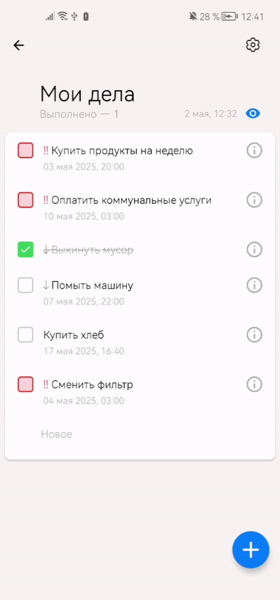

# TODO App

Приложение для управления задачами, разработанное в рамках первого этапа Школы мобильной разработки Яндекса.

## Демо

## Технологии

* Многомодульная архитектура
* Clean Architecture
* MVI
* Jetpack Compose и Android View
* Room
* Retrofit
* Dagger 2
* Jetpack Navigation
* Gradle Plugin

## Основной функционал

* Создание, редактирование и удаление задач
* Синхронизация с сервером
* Работа с приоритетами
* Поддержка темной темы
